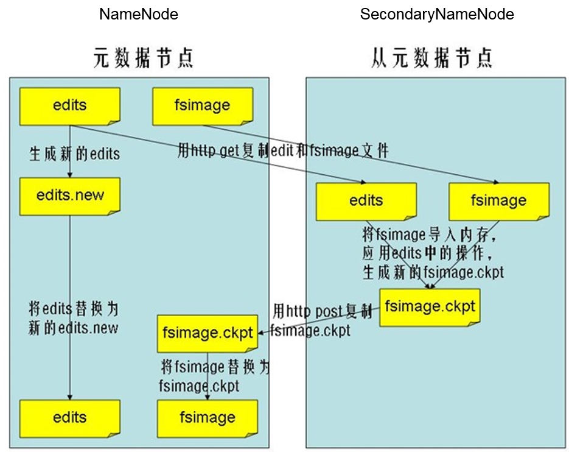

## HDFS架构

* NameNode
* DataNode
* Secondary NameNode

  
  
* 元数据存储细节  
    
       
  
### 一、NameNode

* 是整个文件系统的管理节点。它**维护着整个文件系统的文件目录树**，文件/目录的元信息和每个文件对应的数据块列表。接收用户的操作请求。文件包括：
     
        hdfs-site.xml的dfs.name.dir属性
     
     * fsimage:元数据镜像文件。存储某一时段NameNode内存元数据信息。
     
     * edits:操作日志文件。
     
     * fstime:保存最近一次checkpoint的时间

* 以上这些文件是保存在linux的文件系统中。

### 二、NameNode的工作特点

* Namenode始终在内存中保存metedata，用于处理“读请求”

* 到有“写请求”到来时，namenode会首先写editlog到磁盘，即向edits文件中写日志，成功返回后，才会修改内存，并且向客户端返回

* Hadoop会维护一个fsimage文件，也就是namenode中metedata的镜像，但是fsimage不会随时与namenode内存中的metedata保持一致，而是每隔一段时间通过合并edits文件来更新内容。Secondary namenode就是用来合并fsimage和edits文件来更新NameNode的metedata的。

### 三、SecondaryNameNode

* HA的一个解决方案。但不支持热备。配置即可。
    
    * HA （双机集群(HA)系统简称）：HA 是High Available缩写，是双机集群系统简称，指高可用性集群，是保证业务连续性的有效解决方案，一般有两个或两个以上的节点，且分为活动节点及备用节点。

* 执行过程：从NameNode上下载元数据信息（fsimage,edits），然后把二者合并，生成新的fsimage，在本地保存，并将其推送到NameNode，替换旧的fsimage.

* 默认在安装在NameNode节点上，但这样...不安全！

 ### 四、secondary namenode的工作流程
 
* 1、secondary通知namenode切换edits文件
* 2、secondary从namenode获得fsimage和edits(通过http)
* 3、secondary将fsimage载入内存，然后开始合并edits
* 4、secondary将新的fsimage发回给namenode
* 5、namenode用新的fsimage替换旧的fsimage

### 五、什么时候checkpiont 

* fs.checkpoint.period：指定两次checkpoint的最大时间间隔，默认3600秒。 

* fs.checkpoint.size：规定edits文件的最大值，一旦超过这个值则强制checkpoint，不管是否到达最大时间间隔。默认大小是64M。

  

  
  
### 六、Datanode

    hdfs-site.xml的dfs.replication属性

* **提供真实文件数据的存储服务**。
* 文件块（block）：最基本的存储单位。对于文件内容而言，一个文件的长度大小是size，那么从文件的０偏移开始，按照固定的大小，顺序对文件进行划分并编号，划分好的每一个块称一个Block。HDFS默认Block大小是128MB，以一个256MB文件，共有256/128=2个Block.
* 不同于普通文件系统的是，HDFS中，如果一个文件小于一个数据块的大小，并不占用整个数据块存储空间
* Replication。多复本。默认是三个。

  
  
  
  
  
  
  
  
  
  
  
  
  
  
  
  
  
  

