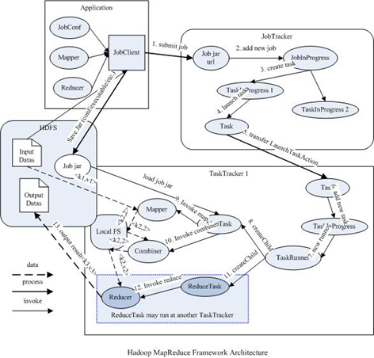
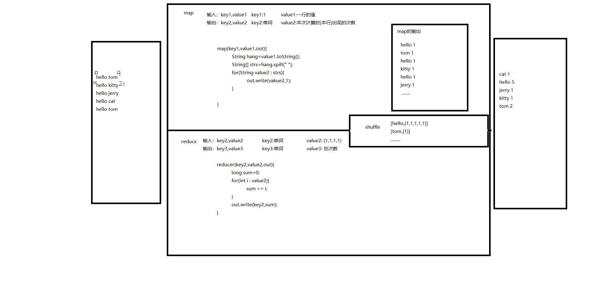

## MapReduce原理

  

### 一、MapReduce概述

* MapReduce是一种分布式计算模型，由Google提出，主要用于搜索领域，解决海量数据的计算问题.

* MR由两个阶段组成：Map和Reduce，用户只需要实现map()和reduce()两个函数，即可实现分布式计算，非常简单。

* 这两个函数的形参是key、value对，表示函数的输入信息。

* 执行步骤：

   * 1、map任务处理
   
      * 1.1、读取输入文件内容，解析成key、value对。对输入文件的每一行，解析成key、value对。每一个键值对调用一次map函数。
      
      * 1.2、写自己的逻辑，对输入的key、value处理，转换成新的key、value输出。
      
      * 1.3、对输出的key、value进行分区。
      
      * 1.4、对不同分区的数据，按照key进行排序、分组。相同key的value放到一个集合中。
      
      * 1.5、(可选)分组后的数据进行归约。
      
  * 2、reduce任务处理
  
      * 2.1、对多个map任务的输出，按照不同的分区，通过网络copy到不同的reduce节点。
      
      * 2.2、对多个map任务的输出进行合并、排序。写reduce函数自己的逻辑，对输入的key、value处理，转换成新的key、value输出。
      
      * 2.3、把reduce的输出保存到文件中。
      

### 二、map、reduce键值对格式

  <table>
     <tr>
        <td>函数</td>
        <td>输入键值对</td>
        <td>输出键值对</td>
     </tr>
     <tr>
        <td>map()</td>
        <td>k1,v1</td>
        <td>k2,v2</td>
     </tr>
     <tr>
        <td>reduce()</td>
        <td>k2,{v2}</td>
        <td>k3,v3</td>
     </tr>
  </table>

### 三、WordCountApp的驱动代码

    public static void main(String[] args) throws Exception {
        Configuration conf = new Configuration();    //加载配置文件
        Job job = new Job(conf);    //创建一个job，供JobTracker使用
        job.setJarByClass(WordCountApp.class);

        job.setMapperClass(WordCountMapper.class);
        job.setReducerClass(WordCountReducer.class);

        FileInputFormat.setInputPaths(job, new Path("hdfs://192.168.1.10:9000/input"));
        FileOutputFormat.setOutputPath(job, new Path("hdfs://192.168.1.10:9000/output"));

        job.setOutputKeyClass(Text.class);
        job.setOutputValueClass(IntWritable.class);

        job.waitForCompletion(true);
    }

### 四、MR(MapReduce)流程

* 代码编写

* 作业配置

* 提交作业

* 初始化作业

* 分配任务

* 执行任务

* 更新任务和状态

* 完成作业

流程.png)

### 五、MR过程各个角色的作用

* jobClient：提交作业

* JobTracker：初始化作业，分配作业，TaskTracker与其进行通信，协调监控整个作业

* TaskTracker：定期与JobTracker通信，执行Map和Reduce任务

* HDFS：保存作业的数据、配置、jar包、结果

### 六、作业提交

* 提交作业之前，需要对作业进行配置
    
    * 编写自己的MR程序
    
    * 配置作业，包括输入输出路径等等

* 提交作业
    
    * 配置完成后，通过JobClient提交

* 具体功能
    
    * 与JobTracker通信得到一个jar的存储路径和JobId
    
    * 输入输出路径检查
    
    * 将jobj ar拷贝到的HDFS
    
    * 计算输入分片，将分片信息写入到job.split中
    
    * 写job.xml
    
    * 真正提交作业

### 七、作业初始化

* 客户端提交作业后，JobTracker会将作业加入到队列，然后进行调度，默认是FIFO方式

* 具体功能

    * 作业初始化主要是指JobInProgress中完成的

    * 读取分片信息

    * 创建task包括Map和Reduce任创建task包括Map和Reduce任务

    * 创建TaskInProgress执行task，包括map任务和reduce任务

### 八、任务分配

* TaskTracker与JobTracker之间的通信和任务分配是通过心跳机制实现的

* TaskTracker会主动定期向JobTracker发送心态信息，询问是否有任务要做，如果有，就会申请到任务。

### 九、任务执行

* 如果TaskTracker拿到任务，会将所有的信息拷贝到本地，包括代码、配置、分片信息等

* TaskTracker中的localizeJob()方法会被调用进行本地化，拷贝job.jar，jobconf，job.xml到本地

* TaskTracker调用launchTaskForJob()方法加载启动任务

* MapTaskRunner和ReduceTaskRunner分别启动java child进程来执行相应的任务

### 十、状态更新

* Task会定期向TaskTraker汇报执行情况

* TaskTracker会定期收集所在集群上的所有Task的信息，并向JobTracker汇报

* JobTracker会根据所有TaskTracker汇报上来的信息进行汇总

### 十一、作业完成

* JobTracker是在接收到最后一个任务完成后，才将任务标记为成功

* 将数结果据写入到HDFS中

### 十二、错误处理

* JobTracker失败
    
    * 存在单点故障，hadoop2.0解决了这个问题

* TraskTracker失败
    
    * TraskTracker崩溃了会停止向JobTracker发送心跳信息。
    
    * JobTracker会将TraskTracker从等待的任务池中移除，并将该任务转移到其他的地方执行
    
    * JobTracker将TaskTracker加入到黑名单中

* Task失败
    
    * 任务失败，会向TraskTracker抛出异常
    
    * 任务挂起

### 十三、JobTracker、TaskTracker与JobClient分工

* JobTracker
    
    * 负责接收用户提交的作业，负责启动、跟踪任务执行。
    
    * JobSubmissionProtocol是JobClient与JobTracker通信的接口。
    
    * InterTrackerProtocol是TaskTracker与JobTracker通信的接口。

* TaskTracker
    
    * 负责执行任务。

* JobClient

* 是用户作业与JobTracker交互的主要接口。

* 负责提交作业的，负责启动、跟踪任务执行、访问任务状态和日志等。

### 十四、例子：实现WordCountApp

* WordCountMapper类

        package com.mr;

        import java.io.IOException;

        import org.apache.hadoop.io.LongWritable;
        import org.apache.hadoop.io.Text;
        import org.apache.hadoop.mapreduce.Mapper;

        public class WordCountMapper extends Mapper<LongWritable, Text, Text, LongWritable> {
          @Override
          protected void map(LongWritable key, Text value, Mapper<LongWritable, Text, Text, 
          LongWritable>.Context context)throws IOException, InterruptedException {
            System.out.println(key);
            String hang=value.toString();
            String[] strings=hang.split(" ");
            for(String string : strings){
              context.write(new Text(string), new LongWritable(1));
            }
          }
        }

* WordCountReducer类

          package com.mr;

          import java.io.IOException;

          import org.apache.hadoop.io.LongWritable;
          import org.apache.hadoop.io.Text;
          import org.apache.hadoop.mapreduce.Reducer;

          public class WordCountReducer extends Reducer<Text, LongWritable, Text, LongWritable>{

            @Override
            protected void reduce(Text key2, Iterable<LongWritable> value2,
                Reducer<Text, LongWritable, Text, LongWritable>.Context context) throws IOException, 
                InterruptedException {
              long sum=0;

              for(LongWritable i :value2){
                sum += i.get();
              }

              context.write(key2,new LongWritable(sum));
            }
          }

* MRClient类

      package com.mr;

      import org.apache.hadoop.conf.Configuration;
      import org.apache.hadoop.fs.Path;
      import org.apache.hadoop.io.LongWritable;
      import org.apache.hadoop.io.Text;
      import org.apache.hadoop.mapreduce.Job;
      import org.apache.hadoop.mapreduce.lib.input.FileInputFormat;
      import org.apache.hadoop.mapreduce.lib.output.FileOutputFormat;

      public class MRClient {

        public static void main(String[] args) throws Exception {
          // TODO Auto-generated method stub
          Configuration configuration=new Configuration();
          Job job=Job.getInstance(configuration);
          //设置当前作业主函数所在类
          job.setJarByClass(MRClient.class);

          job.setMapperClass(WordCountMapper.class);
          job.setMapOutputKeyClass(Text.class);
          job.setMapOutputValueClass(LongWritable.class);
          FileInputFormat.setInputPaths(job, "hdfs://hadoop01:9000/words");

          job.setReducerClass(WordCountReducer.class);
          job.setOutputKeyClass(Text.class);
          job.setOutputValueClass(LongWritable.class);
          FileOutputFormat.setOutputPath(job,new Path("hdfs://hadoop01:9000/out"));
          //提交作业，参数：true为显示计算过程，false不显示计算过程
          job.waitForCompletion(true);		
        }
      }

* 操作

        [root@hadoop01 /]# cd /mnt/softWare/hadoop-2.2.0/sbin/
        [root@hadoop01 sbin]# ./start-dfs.sh 
        [root@hadoop01 sbin]# ./start-yarn.sh
        [root@hadoop01 sbin]# cd / 
        [root@hadoop01 /]# vim /words
        [root@hadoop01 /]# cat /words 
        hello tom
        hello kittty
        hello jerry
        hello cat
        hello tom
        [root@hadoop01 /]# hdfs dfs -put /words /
        [root@hadoop01 /]# hadoop jar WordCount.jar 

