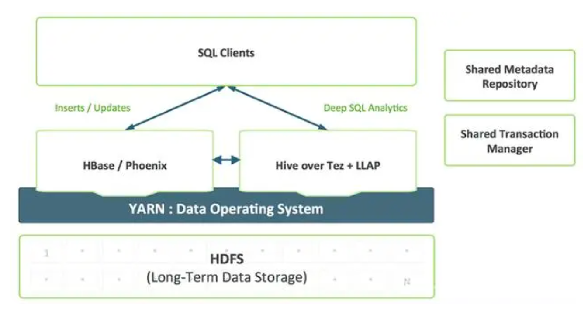

### Hbase是数据库，Hive是数据仓库
* Hbase，其实是Hadoop database的简称，是一种NoSQL数据库，主要适用于海量明细数据（十亿、百亿）的随机实时查询，如日志明细、交易清单、轨迹行为等。
* Hive，Hadoop数据仓库，通过SQL来处理和计算HDFS的数据，Hive会将SQL翻译为Mapreduce来处理数据，适用于离线的批量数据计算。

Hive中的表是纯逻辑表，就只是表的定义等，即表的元数据。Hive本身不存储数据，它完全依赖HDFS和MapReduce。这样就可以将结构化的数据文件映射为为一张数据库表，并提供完整的SQL查询功能，并将SQL语句最终转换为MapReduce任务进行运行。
而HBase表是物理表，适合存放非结构化的数据。

Hive是基于MapReduce来处理数据，而MapReduce处理数据是基于行的模式；
HBase处理数据是基于列的而不是基于行的模式，适合海量数据的随机访问。

HBase的表是疏松的存储的，因此用户可以给行定义各种不同的列；
而Hive表是稠密型，即定义多少列，每一行有存储固定列数的数据。

Hive使用Hadoop来分析处理数据，而Hadoop系统是批处理系统，因此不能保证处理的低迟延问题；
而HBase是近实时系统，支持实时查询。