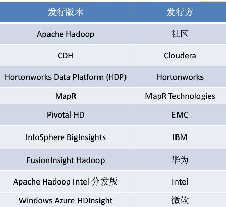
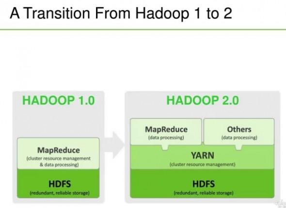
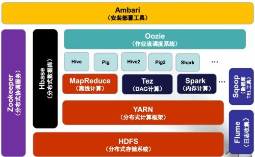

## 大数据简介

大数据（big data），根据百度的解释，指无法在一定时间范围内用`常规软件工具`进行捕捉、管理和处理的数据集合，是需要新处理模式才能具有更强的 决策力、洞察发现力和流程优化能力的海量、高增长率和多样化的信息资产。

这里的常规软件指的是传统的关系型数据库（如oracle、sqlserver），数据量和处理要求超过它们的处理能力。新的处理模式主要是指hadoop、 分布式数据库等技术，它的系统架构能满足海量数据的处理要求。

有了大数据，有了更多的历史数据，我们就可以做更精准的分析和挖掘，就可以更好的发现问题，更好的解决问题，更好的预测未来，使事物按照我们希望的方向发展。

大数据中的数据量非常巨大，达到了PB级别。而且这庞大的数据之中，不仅仅包括结构化数据（如数字、符号等数据），还包括非结构化数据（如文本、图像、声音、视频等数据）。这使得大数据的存储，管理和处理很难利用传统的关系型数据库去完成。在大数据之中，有价值的信息往往深藏其中。这就需要对大数据的处理速度要非常快，才能短时间之内就能从大量的复杂数据之中获取到有价值的信息。在大数据的大量复杂的数据之中，通常不仅仅包含真实的数据，一些虚假的数据也混杂其中。这就需要在大数据的处理中将虚假的数据剔除，利用真实的数据来分析得出真实的结果。

* 大数据分析（Big Data Analysis）
    * 1>可视化分析（Analytic Visualization）eg:[Echarts](http://echarts.baidu.com/index.html)

      可视化分析是普通消费者常常可以见到的一种大数据分析结果的表现形式，比如说百度制作的“百度地图春节人口迁徙大数据”就是典型的案例之一。可视化分析将大量复杂的数据自动转化成直观形象的图表，使其能够更加容易的被普通消费者所接受和理解。

    * 2>数据挖掘算法（Date Mining Algorithms）

      `数据挖掘算法是大数据分析的理论核心`，其本质是一组根据算法事先定义好的数学公式，将收集到的数据作为参数变量带入其中，从而能够从大量复杂的数据中提取到有价值的信息。

      著名的“啤酒和尿布”的故事就是数据挖掘算法的经典案例。沃尔玛通过对啤酒和尿布购买数据的分析，挖掘出以前未知的两者间的联系，并利用这种联系，提升了商品的销量。

      亚马逊的推荐引擎和谷歌的广告系统都大量使用了数据挖掘算法。

    * 3>预测性分析能力（Predictive Analytic Capabilities）

      `预测性分析能力是大数据分析最重要的应用领域。`从大量复杂的数据中挖掘出规律，建立起科学的事件模型，通过将新的数据带入模型，就可以预测未来的事件走向。

      预测性分析能力常常被应用在金融分析和科学研究领域，用于股票预测或气象预测等。

    * 4>语义引擎（Semantic Engines）

      `语义引擎是机器学习的成果之一。`
      过去，计算机对用户输入内容的理解仅仅停留在字符阶段，不能很好的理解输入内容的意思，因此常常不能准确的了解用户的需求。通过对大量复杂的数据进行分析，让计算机从中自我学习，可以使计算机能够尽量精确的了解用户输入内容的意思，从而把握住用户的需求，提供更好的用户体验。

      苹果的Siri和谷歌的Google Now都采用了语义引擎。

    * 5>数据质量管理（Data Quality Management）

      `数据质量管理是大数据在企业领域的重要应用。`为了保证大数据分析结果的准确性，需要将大数据中不真实的数据剔除掉，保留最准确的数据。这就需要建立有效的数据质量管理系统，分析收集到的大量复杂的数据，挑选出真实有效的数据。

* 分布式计算（Distributed Computing）
    * 对于如何处理大数据，计算机科学界有两大方向：
        * 第一个方向是`集中式计算`

          集中式计算，就是通过不断增加处理器的数量来增强单个计算机的计算能力，从而提高处理数据的速度。

        * 第二个方向是`分布式计算`

          分布式计算，就是把一组计算机通过网络相互连接组成分散系统，然后将需要处理的大量数据分散成多个部分，交由分散系统内的计算机组同时计算，最后将这些计算结果合并得到最终的结果。

  尽管分散系统内的单个计算机的计算能力不强，但是由于每个计算机只计算一部分数据，而且是多台计算机同时计算，所以就分散系统而言，处理数据的速度会远高于单个计算机。过去，分布式计算理论比较复杂，技术实现比较困难，因此在处理大数据方面，集中式计算一直是主流解决方案。IBM的大型机就是集中式计算的典型硬件，很多银行和政府机构都用它处理大数据。不过，对于当时的互联网公司来说，IBM的大型机的价格过于昂贵。因此，互联网公司的把研究方向放在了可以使用在廉价计算机上的分布式计算上。

* 服务器集群（Server Cluster）

  服务器集群是一种提升服务器整体计算能力的解决方案。它是由互相连接在一起的服务器群所组成的一个并行式或分布式系统。服务器集群中的服务器运行同一个计算任务。因此，从外部看，这群服务器表现为一台虚拟的服务器，对外提供统一的服务。尽管单台服务器的运算能力有限，但是将成百上千的服务器组成服务器集群后，整个系统就具备了强大的运算能力，可以支持大数据分析的运算负荷。Google，Amazon，阿里巴巴的计算中心里的服务器集群都达到了5000台服务器的规模。

### 一、大数据

* 1、大数据的5V特点（IBM提出）：
    * 1>Volume（大量）数据量大
    * 2>Velocity（高速）处理速度快
    * 3>Variety（多样）数据种类多
    * 4>Value（低价值密度）价值密度低
    * 5>Veracity（真实性）

* 2、大数据的特征决定如何发挥大数据的价值：
    * 一是要有海量、真实的数据（Volume、Veracity）；
    * 二是对不同结构数据进行规格化，保障数据口径的一致性（Variety）；
    * 三是根据业务要求，对数据采取相应的存储和处理技术，生成有价值、满足时效性的数据（Value、Velocity）。
* 3、大数据技术
    * 数据采集
    * 数据存储和管理
    * 数据处理与分析
    * 数据隐私和安全
* 4、大数据处理模式
    * 批处理模式
    * 流模式
    * 图模式
    * 查询分析模式

### 二、主流的三大分布式计算系统：

* 1、Hadoop

      Hadoop常用于离线的复杂的大数据处理。（使用硬盘来存储数据）

    * Hadoop-->Apache开源的分布式计算平台
    * Hadoop特性
        * 1>高可靠
        * 2>高效
        * 3>高可扩展
        * 4>高容错
        * 5>低成本
        * 6>Java开发
        * 7>运行在linux系统
        * 8>支持多个语言api
    * Hadoop企业架构--

  Yahoo的工程师Doug Cutting和Mike Cafarella在2005年合作开发了分布式计算系统Hadoop。后来，Hadoop被贡献给了Apache基金会，成为了Apache基金会的开源项目。Doug
  Cutting也成为Apache基金会的主席，主持Hadoop的开发工作。Hadoop采用MapReduce分布式计算框架，并根据GFS开发了HDFS分布式文件系统，根据BigTable开发了HBase数据存储系统。尽管和Google内部使用的分布式计算系统原理相同，但是Hadoop在运算速度上依然达不到Google论文中的标准。不过，Hadoop的开源特性使其成为分布式计算系统的事实上的国际标准。Yahoo，Facebook，Amazon以及国内的百度，阿里巴巴等众多互联网公司都以Hadoop为基础搭建自己的分布式计算系统。
* 2、Spark

      Spark常用于离线的快速的大数据处理。（使用内存来存储数据）

  Spark也是Apache基金会的开源项目，它由加州大学伯克利分校的实验室开发，是另外一种重要的分布式计算系统。它在Hadoop的基础上进行了一些架构上的改良。Spark与Hadoop最大的不同点在于，Hadoop使用硬盘来存储数据，而Spark使用内存来存储数据，因此Spark可以提供超过Hadoop100倍的运算速度。但是，由于内存断电后会丢失数据，Spark不能用于处理需要长期保存的数据。

* 3、Storm

      Storm常用于在线的实时的大数据处理。（处理网络数据）

  Storm是Twitter主推的分布式计算系统，它由BackType团队开发，是Apache基金会的孵化项目。它在Hadoop的基础上提供了实时运算的特性，可以实时的处理大数据流。不同于Hadoop和Spark，Storm不进行数据的收集和存储工作，它直接通过网络实时的接受数据并且实时的处理数据，然后直接通过网络实时的传回结果。

### 三、Hadoop

* 1、Hadoop发行版本
  

* 2、Hadoop1.0和2.0区别
  

* 3、Hadoop项目架构
  
